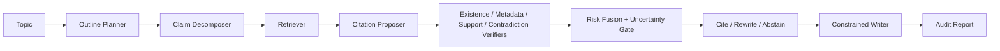

# CiteGuard

**CiteGuard** is an early-stage **falsification-first research agent** for trustworthy scientific writing.

Instead of asking an LLM to draft first and verify later, CiteGuard treats academic writing as a structured `claim -> citation -> evidence` verification problem:

- retrieve candidate papers
- resolve whether they exist
- check metadata consistency
- test whether they actually support the claim
- abstain or rewrite when evidence is weak

The project is currently best understood as a **research prototype**, not a production citation system.

## Why This Project Exists

Citation hallucinations in scientific writing are especially dangerous because they can look polished while being wrong in at least three different ways:

- the paper does not exist
- the metadata is stitched together incorrectly
- the paper exists, but does not support the sentence it is cited for

CiteGuard is built around the idea that a writing agent should behave more like a skeptical reviewer than an eager autocomplete system.

## Current Status

- `Alpha research prototype`
- Claim-level planning, retrieval, verification, constrained writing, and audit reporting are implemented
- Live scholarly adapters are available for `OpenAlex`, `Crossref`, `arXiv`, and `Semantic Scholar`
- Support verification can run with a heuristic baseline or real reranker + NLI models
- Support threshold and ensemble weight calibration tooling is included

## What It Can Do Today

- Build a lightweight `Claim-Citation-Evidence Graph (CCEG)`
- Verify candidate citations with:
  - `ExistenceVerifier`
  - `MetadataVerifier`
  - `SupportVerifier`
  - `ContradictionVerifier`
- Harvest best-effort evidence chunks from live scholarly landing pages
- Fuse heuristic, reranker, and NLI support signals through a calibratable ensemble policy
- Generate cite / rewrite / abstain decisions for each claim
- Emit audit-friendly output showing evidence provenance and verifier outcomes

## System Overview



## Repository Layout

```text
CiteGuard/
├── configs/        # retrieval, verifier, and experiment configs
├── docs/           # proposal, architecture, benchmark, and analysis notes
├── examples/       # small demo corpus and calibration examples
├── experiments/    # saved experiment outputs
├── scripts/        # runnable entry points
├── src/            # core implementation
├── tests/          # unit tests
├── CITATION.cff
├── CONTRIBUTING.md
├── LICENSE
└── pyproject.toml
```

## Installation

Recommended setup:

```bash
python3 -m venv .venv
. .venv/bin/activate
python -m pip install --upgrade pip
```

Base installation:

```bash
python -m pip install -e .
```

Install the optional model stack for real reranker + NLI inference:

```bash
python -m pip install -r requirements-optional.txt
```

Install the optional API dependencies:

```bash
python -m pip install -e ".[api]"
```

## Quick Start

Run the built-in demo:

```bash
python3 scripts/run_agent.py \
  --topic "citation hallucination in scientific writing" \
  --section-count 2
```

Run against the example corpus:

```bash
python3 scripts/run_agent.py \
  --topic "citation hallucination in scientific writing" \
  --corpus examples/demo_corpus.json \
  --section-count 2
```

Use live scholarly sources:

```bash
python3 scripts/run_agent.py \
  --topic "citation hallucination in scientific writing" \
  --live-sources openalex,crossref,arxiv \
  --section-count 1
```

Warm up the production reranker and NLI models:

```bash
python3 scripts/warmup_support_models.py
```

Run the demo evaluation:

```bash
python3 scripts/evaluate.py \
  --topic "citation hallucination in scientific writing"
```

Run support calibration:

```bash
python3 scripts/calibrate_support.py \
  --profile quick \
  --dataset examples/support_calibration_examples.json \
  --output experiments/support_calibration/quick_results.json
```

## Real Scholarly Sources

CiteGuard currently includes adapters for:

- `OpenAlex`
- `Crossref`
- `arXiv`
- `Semantic Scholar`

Important caveats:

- live evidence harvesting is best-effort and depends on what a landing page exposes
- publisher pages vary widely in structure, so `Crossref` results may include rich chunks for some papers and none for others
- `Semantic Scholar` works better with an API key via `SEMANTIC_SCHOLAR_API_KEY`
- first model-backed runs download model weights from Hugging Face and can take noticeably longer

## Reproducibility Notes

- Unit tests are in `tests/`
- GitHub Actions CI runs the unit test suite plus a lightweight heuristic demo evaluation
- `examples/` contains small reusable inputs for corpus-based runs and calibration
- `experiments/support_calibration/quick_results.json` stores a sample quick-calibration output

Run tests locally:

```bash
python3 -m unittest discover -s tests -v
```

## Current Limitations

- This is not yet a production-grade citation service
- The benchmark is still small and prototype-oriented
- The support calibration set should be expanded into a cleaner dev/test split with human-reviewed labels
- Evidence extraction from live sources is intentionally conservative and may return zero chunks on some publisher pages
- The API surface is still minimal

## Project Documents

- Proposal: [docs/proposal.md](docs/proposal.md)
- Architecture: [docs/architecture.md](docs/architecture.md)
- GitHub launch pack: [docs/github_launch.md](docs/github_launch.md)
- Benchmark design: [docs/benchmark_design.md](docs/benchmark_design.md)
- Benchmark TODO: [docs/benchmark_todo.md](docs/benchmark_todo.md)
- Benchmark issue drafts: [docs/issues/benchmark_phase1_issue_drafts.md](docs/issues/benchmark_phase1_issue_drafts.md)
- Benchmark issue final copy: [docs/issues/benchmark_phase1_issue_final.md](docs/issues/benchmark_phase1_issue_final.md)
- Benchmark issue posting pack: [docs/issues/benchmark_phase1_issue_posting_pack.md](docs/issues/benchmark_phase1_issue_posting_pack.md)
- Benchmark project board draft: [docs/issues/benchmark_phase1_project_board.md](docs/issues/benchmark_phase1_project_board.md)
- Benchmark issue quick reference: [docs/issues/benchmark_phase1_issue_quickref.md](docs/issues/benchmark_phase1_issue_quickref.md)
- Benchmark project CSV draft: [docs/issues/benchmark_phase1_project_import.csv](docs/issues/benchmark_phase1_project_import.csv)
- Error analysis: [docs/error_analysis.md](docs/error_analysis.md)
- Release draft: [docs/releases/v0.1.0.md](docs/releases/v0.1.0.md)
- Roadmap: [ROADMAP.md](ROADMAP.md)
- Contribution guide: [CONTRIBUTING.md](CONTRIBUTING.md)

## Citation

If you use this repository in research, please cite the software record in [CITATION.cff](CITATION.cff).

## License

Released under the [MIT License](LICENSE).

## 中文说明

`CiteGuard` 的定位是“科研写作中的引用证伪原型系统”，不是一个已经产品化的论文写作平台。当前最有价值的部分，是它把学术写作建模成了 `claim -> citation -> evidence` 的验证问题，并已经具备：

- 多源 scholarly adapter
- claim-level verifier 链路
- 真实 reranker / NLI 支撑判定
- evidence chunk 接线
- calibration 实验脚手架

