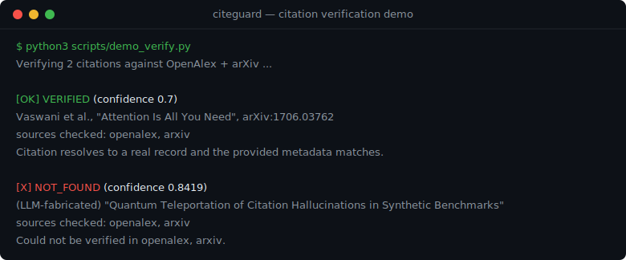

# CiteGuard

[](https://github.com/xiaweiyi713/citeguard/actions/workflows/ci.yml)
[](LICENSE)
[](pyproject.toml)

**A falsification-first toolkit that checks citations — does the cited paper exist, is its metadata correct, and does it actually support the sentence? — against live scholarly sources, callable from Claude Code, Codex, Cursor, and any other MCP client.**

LLM writing assistants hallucinate references: they invent papers, stitch together wrong metadata, and cite real papers that don't support the claim. CiteGuard is the skeptical reviewer that catches this — the check an agent can't reliably do on its own. It treats every citation as a `claim → citation → evidence` problem and tries to *disprove* it; when it can't be sure, it says so instead of guessing.

> **Status:** Alpha (`v0.1.0`). The verification toolkit below is the actively developed core. An earlier end-to-end "writing agent" prototype also lives in the repo (see [Project layout](#project-layout)) but is no longer the focus.

---

## See it work



Run it yourself (hits live OpenAlex + arXiv):

```bash
python3 scripts/demo_verify.py
```

```text
Verifying 2 citations against OpenAlex + arXiv ...

[OK] VERIFIED           (confidence 0.7)
    Vaswani et al., "Attention Is All You Need", arXiv:1706.03762
    sources checked: openalex, arxiv
    Citation resolves to a real record and the provided metadata matches.

[X] NOT_FOUND          (confidence 0.8419)
    (LLM-fabricated) "Quantum Teleportation of Citation Hallucinations in Synthetic Benchmarks"
    sources checked: openalex, arxiv
    Could not be verified in openalex, arxiv.
```

> Output is captured live, so exact confidence and matched-record details can drift with source data.

---

## What it does

CiteGuard answers two questions, against **OpenAlex, Crossref, arXiv, and Semantic Scholar**.

### 1. Does the paper exist, and is the metadata right?

`verify_citation` / `audit_citations` resolve a citation (identifier-first, else title) and compare each field you provided:

| verdict | meaning |
|---|---|
| `verified` | the paper exists and the provided metadata matches |
| `metadata_mismatch` | the paper exists but a field disagrees — comes with a **suggested corrected citation** |
| `not_found` | could not be verified in the queried sources (flagged high-risk, **not** declared fake) |
| `ambiguous` | several plausible matches — asks for a DOI/arXiv id to disambiguate |

### 2. Does the paper support the claim? (deep mode)

`check_claim_support` resolves the paper, then judges its abstract against your claim sentence using a reranker + NLI ensemble:

| verdict | meaning |
|---|---|
| `supported` | the abstract entails the claim |
| `weakly_supported` | partial / related evidence, but not strong enough |
| `insufficient_evidence` | the abstract does not address the claim — **abstain**, not "unsupported" |
| `contradicted` | the abstract actively contradicts the claim |

Support results include a machine-readable `evidence_scope` (`title`,
`abstract`, `metadata`, `metadata_snippet`, `full_text`, `mixed`,
`mixed_with_full_text`, or `none`) so agents can avoid presenting abstract-level
evidence as a full-text conclusion. Full-text support is opt-in: callers can
provide short lawful excerpts via CLI/MCP/JSON inputs or local text/PDF
`--full-text-file` / JSON `full_text_file` paths. PDF extraction uses optional
`pypdf`/`PyPDF2` when installed (`pip install "citeguard[pdf]"`); CiteGuard
still does not scrape gated sources, download remote full text, or bypass
paywalls. If deep support models are installed
but fail to load or time out, support outputs include `model_failure_details`
with `error_code=model_unavailable` and fall back to available weaker scoring.

Two guardrails keep it honest: a source being **unreachable is never escalated to "fabricated"** (it lowers confidence, sets `outage_limited=true` for outage-limited `not_found` results, and reports `sources_available`, `sources_failed`, and `source_failure_mode`), and `insufficient_evidence` / `not_found` are phrased as "could not confirm", leaving the final judgment to a human or the host agent.

---

## Quick start

The **core library has zero third-party dependencies** and runs on Python ≥ 3.9.

```bash
python -m pip install -e .            # core library
python -m pip install -e ".[mcp]"     # + MCP server (requires Python >= 3.10)
python -m pip install -e ".[models]"  # + reranker/NLI stack for support deep mode (heavy)
python -m pip install -e ".[api]"     # + FastAPI surface
```

Check your local configuration before live verification:

```bash
citeguard status
python -m citeguard status
citeguard status --check-sources  # optional live per-source health probe
```

Inspect or clear the local SQLite cache:

```bash
citeguard cache inspect
citeguard cache export --deterministic --output replay_fixture.json
citeguard cache clear
```

Verify one citation from the shell:

```bash
citeguard verify \
  --title "Attention Is All You Need" \
  --author "Ashish Vaswani" \
  --year 2017 \
  --arxiv-id 1706.03762
```

Batch-check a JSON list:

```bash
citeguard audit examples/citations.json
citeguard audit examples/citations.json --high-risk-only
```

Batch inputs may be either JSON arrays (`.json`) or newline-delimited JSON
object streams (`.jsonl`).

Extract citation candidates from a manuscript or bibliography:

```bash
citeguard extract examples/references.md
citeguard audit examples/references.md
```

Extraction supports Markdown/plain text reference sections, LaTeX `\bibitem`,
BibTeX entries, and `.docx` document text using only the standard library.

Check whether a paper supports a claim:

```bash
citeguard support \
  --claim "The Transformer relies entirely on attention." \
  --title "Attention Is All You Need" \
  --arxiv-id 1706.03762
citeguard support \
  --claim "A claim that needs body-text evidence." \
  --title "A verified paper title" \
  --full-text-file lawful_excerpt.txt
citeguard support \
  --claim "A claim that needs body-text evidence." \
  --title "A verified paper title" \
  --full-text-file lawful_local_paper.pdf
```

Search for possible counter-evidence leads:

```bash
citeguard counterevidence --claim "The Transformer relies entirely on attention."
```

Batch-check claim/citation pairs:

```bash
citeguard support-audit examples/claim_citations.json
citeguard support-audit examples/claim_citations.jsonl
citeguard support-audit examples/claim_citations_full_text.json
citeguard support-audit examples/claim_citations.json --high-risk-only
citeguard support-audit examples/claim_citations.json --with-counterevidence
```

Each `support-audit` item can be a single claim/citation pair, or a claim with a
`citations` array when the sentence cites multiple papers.

Check whether one claim is supported by a set of citations:

```bash
citeguard support-set examples/citations.json \
  --claim "Citation auditing should verify existence, metadata, and claim support."
```

Single verification/support results and batch `risk_ranking` rows include a
stable `next_action` enum plus human-readable context, so agents can triage
`not_found`, `ambiguous`, `metadata_mismatch`, contradicted, and unresolved
support checks without parsing prose. Citation-audit risk rows also include
`mismatched_fields`, `suggested_citation`, and canonical identifiers when a
metadata correction is available, so agents can propose repairs from the
risk-sorted list without re-parsing full result rows. Batch `audit` and
`support-audit` reports
also include `review_summary` with full-batch risk counts, next-action counts,
top risk indexes, and `action_queues` grouped into stable index lists such as
`identity_resolution_indexes`, `evidence_review_indexes`,
`rewrite_or_replace_indexes`, `source_retry_indexes`, and
`safe_to_keep_indexes`. Common `next_action` values include
`keep`, `keep_claim`,
`review_metadata`,
`resolve_identifier_or_replace`, `disambiguate_identifier`,
`retry_or_check_source_health`, `review_counterevidence_leads`,
`inspect_full_text_or_find_stronger_citation`, and
`rewrite_or_replace_evidence`. Claim-support outputs also include
`counterevidence_review`; when it is `true`, treat the item as needing
human/full-text review for contradiction, weak support, insufficient evidence, or
unresolved citation identity.
When using `--high-risk-only`, the `filtered` block includes
`returned_indexes` and `omitted_indexes` so the compact result list can still be
mapped back to the original batch input. It also includes
`omitted_review_summary`, preserving the omitted items' next-action counts and
review queues so agents can report what was hidden by the high-risk filter.
Use `--with-counterevidence` on support batch commands when you want CiteGuard to
attach possible counter-evidence candidates to those review-worthy items; these
are leads to inspect, not contradiction verdicts. Counter-evidence reports
include `next_action`, `query_plan`, `query_results`, and per-candidate
`matched_query_roles` so agents can explain whether a lead came from the
original claim search, a negation probe, an exception probe, or a
`source_outage_safety` probe for overclaims that treat source failures as
fabrication evidence, including Chinese claims such as "源不可达/未找到证明引用伪造".
`signal=source_outage_safety_cue` is still only a review lead, not a
contradiction verdict.
Support-set reports include `support_mode` and per-evidence citation `index` so
agents can distinguish a single strong citation from multiple weak citations
without overstating tentative corroboration.

CLI commands print JSON on success. Expected usage, input, file, and JSON-parse
errors are also machine-readable on stderr. MCP tools use the same shape for
expected tool-input errors, returned as the tool result instead of a transport
exception:

```json
{"ok": false, "schema_version": 1, "error": {"code": "missing_citation_input", "message": "...", "details": {}, "recovery": "Ask for a DOI, arXiv id, title, or pasted reference.", "next_action": "provide_missing_input"}, "exit_code": 2}
```

See [`docs/error_codes.md`](docs/error_codes.md) for the stable error-code
contract, `error.next_action` mapping, and agent recovery policy.

### As an agent tool (MCP) — the primary path

```bash
python -m pip install -e ".[mcp]"
citeguard-mcp          # stdio transport
```

Register it in any MCP-compatible client (Claude Code example):

```json
{
  "mcpServers": {
    "citeguard": { "command": "citeguard-mcp" }
  }
}
```

After connecting the server, call `citeguard_status_tool` once. It reports the
configured scholarly sources, cache path and non-sensitive `cache_status`,
MCP/Python readiness, contact-email status, Semantic Scholar key presence, and
whether deep claim-support model dependencies are installed, without querying
live sources or loading model weights. It also includes `remote_evidence_policy`
and a source-level
`source_health` block that says which sources are configured, whether a fixture
is bypassing live sources, whether gated-source host suffixes are blocked, and
whether source-specific credentials such as `CITEGUARD_MAILTO` or
`SEMANTIC_SCHOLAR_API_KEY` are configured. `source_health.summary` gives agents a
compact `degraded` flag, status counts, available/failed source lists, stable
`failure_count`, summary-level `failure_details`, `failure_kind_counts`,
`failure_kind_sources`, `recovery_code`, and stable `next_action` for
retry/configuration decisions.
`cache_status` gives agents cache schema version, entry counts, timestamp
bounds, `inspect_ok`, and stable `next_action` without exposing raw cache
queries.

Run an offline end-to-end stdio smoke test when the MCP SDK is installed:

```bash
python3 scripts/smoke_mcp.py
python3 scripts/smoke_mcp.py --require-sdk  # CI/release: fail if the MCP SDK is missing
```

The smoke test starts the installed `citeguard-mcp` console entry point when
available, initializes an MCP client session, lists tools, calls
`citeguard_status_tool`, verifies a fixture citation, runs one fixture-backed
audit batch with `review_summary`, runs one fixture-backed claim-support check
plus one citation-set support-audit check with `review_summary`, calls
`search_counterevidence_tool` for an offline review lead, and checks structured
expected-error payloads without contacting live scholarly sources. If the MCP SDK
is missing, the default command prints a clear skip message; `--require-sdk`
turns that into a failure for CI and release checks. The core package supports
Python 3.9+, but the MCP SDK requires Python 3.10+; run real MCP stdio
acceptance from a Python 3.10+ environment.

For agent clients that support skills or reusable instructions, [`skills/citeguard-verify/SKILL.md`](skills/citeguard-verify/SKILL.md) makes CiteGuard **proactively** verify citations while you write (and present results without silently editing your text). It includes scenario routing for bibliographies, generated related-work citations, claim-support checks, ambiguity, metadata mismatches, and source-limited results, and is written for MCP-compatible agents such as Codex, Claude Code, Cursor, and similar clients.

### As a Python library

```python
from citeguard.retrieval.scholarly_clients import build_live_metadata_source
from citeguard.verification import parse_citation, verify_citation, check_claim_support, check_claim_support_set

source = build_live_metadata_source(["openalex", "arxiv"], mailto="you@example.com")

# Existence + metadata
result = verify_citation(parse_citation(title="Attention Is All You Need", arxiv_id="1706.03762"), source)
print(result.verdict.value, result.confidence)          # -> verified 0.7

# Claim support (deep mode needs the [models] extra; otherwise falls back to a labelled heuristic)
support = check_claim_support("The Transformer relies entirely on attention.",
                              parse_citation(title="Attention Is All You Need", arxiv_id="1706.03762"),
                              source)
print(support.verdict.value, support.engine)

support_set = check_claim_support_set("The Transformer relies entirely on attention.",
                                      [parse_citation(title="Attention Is All You Need", arxiv_id="1706.03762")],
                                      source)
print(support_set.verdict.value, support_set.risk)
```

---

## MCP tools

| tool | what it does |
|---|---|
| `citeguard_status_tool` | inspect MCP/Python readiness, cache readiness, source selection, and model dependency status without live queries |
| `verify_citation_tool` | verify one citation; returns verdict, canonical record, per-field diffs, suggested fix, sources checked |
| `audit_citations_tool` | verify a list of citations; returns a per-item report plus a verdict-count summary |
| `check_claim_support_tool` | judge whether a cited paper supports a claim sentence (deep mode) |
| `check_claim_support_set_tool` | judge whether one claim is supported by a set of cited papers |
| `search_counterevidence_tool` | search for possible counter-evidence candidates; review leads only, not a contradiction verdict |
| `audit_claim_support_tool` | judge a list of claim/citation pairs and summarize support verdicts |

Configuration via environment variables:

| variable | default | purpose |
|---|---|---|
| `CITEGUARD_SOURCES` | `openalex,crossref,arxiv` | which sources to query |
| `CITEGUARD_MAILTO` | `research@example.com` | polite-pool contact for OpenAlex/Crossref |
| `SEMANTIC_SCHOLAR_API_KEY` | — | optional, improves Semantic Scholar access |
| `CITEGUARD_CACHE` | `data/logs/verification_cache.sqlite` | local SQLite resolution cache |
| `CITEGUARD_FIXTURE_CITATIONS` | — | JSON/JSONL citation fixture for deterministic offline runs |
| `CITEGUARD_HTTP_TIMEOUT` | `10` | timeout, in seconds, for live scholarly API calls |
| `CITEGUARD_HTTP_RETRIES` | `1` | short retries for transient `429`/`5xx`/timeout failures |
| `CITEGUARD_HTTP_RETRY_BACKOFF` | `0.2` | base retry backoff, in seconds; `Retry-After` is respected with a short cap |
| `CITEGUARD_REMOTE_EVIDENCE` | `0` | set to `1` to fetch landing-page snippets in addition to title/abstract metadata |
| `CITEGUARD_EVIDENCE_TIMEOUT` | `2` | timeout, in seconds, for each landing-page evidence fetch when remote evidence is enabled |
| `CITEGUARD_RERANKER_MODEL` | English cross-encoder | support reranker model — set a multilingual one for non-English claims |
| `CITEGUARD_NLI_MODEL` | English NLI | support NLI model — set a multilingual one for non-English claims |

Support deep mode downloads model weights on first use; pre-download with `python3 scripts/warmup_support_models.py`. Without the models installed, support runs a labelled `heuristic` engine (which never emits `supported` or `contradicted`). Remote landing-page evidence harvesting is disabled by default so CLI/MCP calls do not appear to hang on slow publisher pages; support checks still use titles, abstracts, and source metadata. Enable `CITEGUARD_REMOTE_EVIDENCE=1` when you want deeper snippet harvesting and are comfortable with slower live calls. If a publisher or DOI landing page times out or rate-limits while metadata resolution succeeds, records keep the citation metadata and add `metadata.evidence_harvest_failures` with `stage=remote_evidence` diagnostics instead of treating the source as unavailable.

The SQLite cache records a schema version, timestamps, source name, query,
operation, and per-record raw match score for search/lookup rows. `citeguard
cache inspect` reports entry counts by key type without exposing raw queries;
`citeguard cache clear` deletes cached rows while preserving schema metadata.
`citeguard cache export --deterministic --output replay_fixture.json` writes
cached resolved records as a deterministic records-only fixture that can be
replayed offline with `CITEGUARD_FIXTURE_CITATIONS=replay_fixture.json`; stdout reports a
manifest with schema version, cache entry counts, cache timestamp bounds, export
timestamp, output path, and exported record count. Exported records include a
`metadata.cache_provenance` block for reproducibility; `--deterministic` strips
timestamp-only provenance from the records file and timestamp-only manifest
fields while keeping source, query, and raw match score. Partial source outages
are not cached.

If `CITEGUARD_SOURCES` contains an unknown source name, the MCP server now fails
with a clear configuration error instead of silently ignoring the typo. The
accepted values are `openalex`, `crossref`, `arxiv`, and Semantic Scholar aliases
such as `semantic_scholar`, `semantic-scholar`, or `s2`.

---

## Chinese support

Text matching is CJK-aware (Chinese characters are preserved and tokenized into character bigrams, with **no extra dependencies**), so Chinese titles and claims can be verified against the many Chinese papers already indexed in OpenAlex/Crossref. For judging Chinese claim support, point `CITEGUARD_RERANKER_MODEL` / `CITEGUARD_NLI_MODEL` at multilingual models.

CNKI (知网) and Wanfang (万方) are **not** integrated: they have no open/free API and we do not scrape gated content. A ChinaXiv feasibility spike concluded NO-GO (its OAI endpoint is access-gated) — see [`docs/chinaxiv_spike.md`](docs/chinaxiv_spike.md); the pluggable source interface remains so an adapter can be added if an open endpoint appears.

---

## How resolution works

1. **Parse** the input; extract a DOI / arXiv id / year from free text when present.
2. **Identifier-first:** a DOI or arXiv id resolves the paper definitively.
3. **Otherwise search** by title across the selected sources and score candidates with a title-dominant match.
4. **Compare** only the fields you actually provided, field by field.
5. **Decide** the verdict (existence/metadata, or support over abstract-level evidence).

---

## Status, scope & known limitations

**In scope today:** existence + metadata verification, abstract-level claim-support verification, user-provided local full-text evidence files, multi-citation claim checks, multi-source adapters, SQLite caching, Markdown/LaTeX/DOCX reference extraction, an MCP server, a Claude Code skill, and offline evals.

**Known limitations**

- **Identifiers are the reliable path.** With a DOI or arXiv id, resolution is definitive — provide one when you can.
- **Title-only matching is best-effort.** A title can map to several records (e.g. an original paper plus a later reprint with a different `publication_year`); without an identifier a correct citation can surface a same-title record and be reported as a `metadata_mismatch` on `year`/`venue`. Treat title-only year/venue mismatches as "needs confirmation".
- **Support is abstract-level unless you provide full-text evidence.** It judges the abstract, harvested metadata snippets, and any lawful local text/PDF evidence you provide; abstain (`insufficient_evidence`) is common and intentional.

**Not yet done:** automated full-text retrieval, full-text multi-hop synthesis across papers, counter-evidence verdicting, a large human-reviewed benchmark. See [ROADMAP.md](ROADMAP.md).

---

## Tests & reproducibility

```bash
python3 -m unittest discover -s tests -v   # full unittest suite; optional MCP stdio smoke skips without the MCP SDK
python3 scripts/smoke_mcp.py               # optional MCP stdio smoke; skips without the MCP SDK
python3 scripts/smoke_mcp.py --require-sdk # CI/release MCP stdio smoke; fails without the MCP SDK
python3 scripts/eval_verification.py       # offline, deterministic existence/metadata eval
python3 scripts/eval_support.py            # deterministic support fixture eval, no model downloads
python3 scripts/eval_support.py --report   # fixture report with case-type/evidence-scope breakdowns
python3 scripts/eval_support.py --report --split test --quality-gate
python3 scripts/eval_support.py --split test --backend heuristic --quality-gate --review-queue-only
python3 scripts/eval_support.py --backend heuristic --report --split test
python3 scripts/eval_support.py --backend production --report --split test  # requires [models] and cached/downloadable weights
python3 scripts/eval_support.py --validate-only  # dataset schema/provenance/coverage gate only
python3 scripts/eval_support.py --validate-only --label-sidecar data/eval/support_eval_label_sidecar.json --min-high-risk-reviewed-by-language zh=0
python3 scripts/eval_verification.py --output-dir experiments --run-id verification-smoke
python3 scripts/eval_support.py --report --split test --quality-gate --output-dir experiments --run-id support-smoke
python3 scripts/compare_support_baselines.py --split test --min-high-risk-reviewed-by-language zh=0 --output-dir experiments --run-id support-baselines-smoke
python3 scripts/smoke_package.py           # fresh-venv source install smoke, including python -m citeguard
python3 scripts/smoke_package.py --install-mode wheel  # fresh-venv wheel install smoke
python3 scripts/smoke_package.py --install-mode sdist  # fresh-venv source distribution smoke
python3 scripts/smoke_package.py --install-mode wheel --extra mcp --with-deps  # verifies MCP extra deps
python3 scripts/release_package_gate.py    # package + public-api + error-code + MCP-contract + CLI error + source-outage + live-source-health + compliance + agent-skill + batch examples + support-label + benchmark-claim release gate; add --require-build-tools before publishing
python3 scripts/release_package_gate.py --skip-install-smoke --include-mcp-extra-smoke --require-mcp-extra-smoke
python3 scripts/release_package_gate.py --skip-install-smoke --include-mcp-stdio-smoke --require-mcp-stdio-smoke
python3 scripts/release_package_gate.py --skip-install-smoke --include-published-smoke-plan --include-published-mcp-smoke-plan
python3 scripts/smoke_published_package.py --version 0.1.0  # dry-run post-publish PyPI/TestPyPI smoke
```

The unit suite, verification eval, support fixture eval, and support dataset
validation are network-free and run in CI. Eval datasets live in [`data/eval/`](data/eval/).
The claim-support seed eval includes 40 evidence-level cases plus citation-set
policy cases. It reports accuracy, supported precision/recall/F1,
per-label precision/recall/F1, abstention rate, false-support rate, contradiction recall,
optional breakdowns by `case_type`, `evidence_scope`, language, and split, a confusion matrix,
high-risk error buckets such as false support and missed contradiction, and
provenance fields for each synthetic seed case. Reports also include
`review_queue`, which ranks the most dangerous support-eval failures first,
`review_queue_summary`, which groups that queue by severity, bucket, and
recommended action, plus
`false_support_analysis`, which summarizes total support overcalls, high-risk
false-support case ids, and breakdowns by case type, evidence scope, language,
and split for release triage.
`--quality-gate` turns the report into a conservative
release gate: by default, any false support, weak false support, or missed
contradiction fails the command with a machine-readable `quality_gate` block.
Failed gates include `quality_gate.review_queue_case_ids` and
`quality_gate.critical_review_case_ids` so agents can inspect the highest-risk
cases first. Use `--review-queue-only` when an agent or release script only
needs the compact support-failure triage payload instead of the full report.
Reports also include `support_set_policy`, a deterministic fixture that checks
claim-level aggregation boundaries such as multiple weak citations remaining
tentative and contradictions dominating the aggregate.
The seed support data is split into `train`, `dev`, and
`test` so calibration and final reporting can be separated. It is a regression
fixture, not a final human-reviewed benchmark. The default support eval backend
is `fixture`, which checks deterministic report plumbing rather than model
quality; use `--backend production` for model-backed metrics. Optional
label-provenance sidecars can record annotator counts, adjudication status,
disagreements, and source locators separately from the compact seed cases.
Sidecar gates can also require high-risk cases to be human-reviewed globally or
by language with `--min-high-risk-reviewed-by-language LANG=N`, require dual
annotation, cap unresolved disagreements, and enforce a minimum raw
dual-annotator agreement rate before a report is treated as benchmark-grade.
The gate metrics include `high_risk_case_count_by_language`,
`high_risk_reviewed_by_language`, and `high_risk_unreviewed_by_language` so
agents can judge language coverage without re-parsing the sidecar summary.
Pass `--output-dir experiments --run-id <name>` to either eval script to save a
standardized experiment folder with `result.json`, `config.json`, and
`manifest.json` for reproducible tables and release evidence.
`scripts/compare_support_baselines.py` writes a compact comparison table for the
deterministic fixture row and the zero-model heuristic baseline, including
quality-gate status and high-risk error bucket counts.
Generate or complete a provenance sidecar draft with:

```bash
python3 scripts/prepare_support_label_sidecar.py \
  --dataset data/eval/support_eval.json \
  --existing-sidecar data/eval/support_eval_label_sidecar.json \
  --include-context \
  --output data/eval/support_eval_label_sidecar.draft.json
```

For independent human labeling, use a blinded annotation packet so reviewers do
not see dataset gold labels:

```bash
python3 scripts/prepare_support_label_sidecar.py \
  --dataset data/eval/support_eval.json \
  --existing-sidecar data/eval/support_eval_label_sidecar.json \
  --annotation-packet \
  --priority high \
  --split test \
  --output experiments/support-label-packet-high-risk-test.json \
  --instructions-output experiments/support-label-packet-high-risk-test-instructions.md
```

Add `--unreviewed-only` to avoid assigning cases that already have human-review
provenance in the sidecar, or use `--review-status single_annotator` to assign
second-reviewer batches for cases that already have one label. Add
`--limit-per-language N`, `--limit-per-case-type N`, or
`--limit-per-evidence-scope N` when a small reviewer batch should stay balanced
across languages, high-risk families, or evidence scopes instead of only taking
the first filtered rows. Each packet includes a machine-readable deterministic
`packet_id` plus `packet_summary` with case ids and counts by language, case
type, evidence scope, split, priority, and current review status for release evidence. The summary uses
stable keys such as `case_count_by_language`, `case_count_by_case_type`, and
`case_count_by_evidence_scope`, plus `case_count_by_review_status` for assigning
single-reviewer, second-reviewer, and adjudication batches.
The `--audit` report also includes `recommended_packets` with ready-to-run
commands for balanced high-risk first review, language-specific high-risk
review, and second-reviewer batches when `single_annotator` cases exist.
When an eval backend fails the support quality gate, turn its triage queue into
a blinded reviewer packet directly:

```bash
python3 scripts/prepare_support_label_sidecar.py \
  --dataset data/eval/support_eval.json \
  --existing-sidecar data/eval/support_eval_label_sidecar.json \
  --annotation-packet \
  --from-review-queue \
  --review-backend heuristic \
  --split test \
  --output experiments/support-label-packet-review-queue-test.json \
  --instructions-output experiments/support-label-packet-review-queue-test-instructions.md
```

The packet follows `review_queue` order and adds `review_queue_rank` as an
assignment-priority field, but it still omits hidden gold labels, adjudicated
labels, prior annotator labels, and model predictions.

The instruction sheet tells reviewers how to label conservatively without
exposing hidden gold or adjudication fields. Merge completed packets back
conservatively; conflicts are reported instead of silently changing gold labels,
and `merge_report.source_packet_ids` records which reviewer packet ids supplied
the annotations:

```bash
python3 scripts/prepare_support_label_sidecar.py \
  --dataset data/eval/support_eval.json \
  --existing-sidecar data/eval/support_eval_label_sidecar.json \
  --merge-annotation-packet experiments/completed-support-label-packet.json \
  --output data/eval/support_eval_label_sidecar.merged.json
```

Apply resolved adjudications explicitly after reviewer discussion:

```bash
python3 scripts/prepare_support_label_sidecar.py \
  --dataset data/eval/support_eval.json \
  --existing-sidecar data/eval/support_eval_label_sidecar.merged.json \
  --apply-adjudications experiments/resolved-support-label-adjudications.json \
  --output data/eval/support_eval_label_sidecar.adjudicated.json
```

---

## Project layout

```text
citeguard/
  verification/   # the core: parse, resolve, verify, audit, cache, claim-support, evals
  cli.py          # zero-dependency `citeguard` command for status/verify/audit
  runtime.py      # shared environment, source, cache, and status configuration
  mcp/            # FastMCP server exposing status + verification tools
  retrieval/      # scholarly source adapters (OpenAlex/Crossref/arXiv/Semantic Scholar) + retrievers
  verifiers/      # existence/metadata + the reranker+NLI support ensemble
  citation/ graph/ audit/                 # shared models and helpers
  orchestrator/ planner/ writer/ benchmark/ api/   # writing-agent and benchmark surfaces
src/                       # legacy compatibility shims for older imports
skills/citeguard-verify/   # reusable Codex/Claude/Cursor agent skill
scripts/                   # demo + eval + corpus/model utilities
data/eval/                 # offline benchmarks
docs/                      # design specs, plans, architecture, spike notes
tests/                     # unittest suite
```

New user code should import from `citeguard` or `citeguard.*`. The legacy
compatibility package remains available for older notebooks/scripts and emits a
`DeprecationWarning`; see [`docs/public_api_migration.md`](docs/public_api_migration.md).

---

## Documents

- Design specs & implementation plans: [`docs/superpowers/`](docs/superpowers/)
- Setup/reference: [`docs/mcp_setup.md`](docs/mcp_setup.md) · [`docs/cli_reference.md`](docs/cli_reference.md) · [`docs/error_codes.md`](docs/error_codes.md) · [`docs/public_api_migration.md`](docs/public_api_migration.md)
- Benchmarks: [`docs/benchmark_design.md`](docs/benchmark_design.md) · [`docs/benchmark_todo.md`](docs/benchmark_todo.md) · [`docs/support_labeling_guidelines.md`](docs/support_labeling_guidelines.md)
- Release/safety: [`docs/release_checklist.md`](docs/release_checklist.md) · [`docs/security_compliance.md`](docs/security_compliance.md)
- Architecture: [`docs/architecture.md`](docs/architecture.md) · Roadmap: [`ROADMAP.md`](ROADMAP.md) · ChinaXiv spike: [`docs/chinaxiv_spike.md`](docs/chinaxiv_spike.md)
- Research framing / proposal: [`docs/proposal.md`](docs/proposal.md)

## Citation

If you use this repository in research, please cite the software record in [`CITATION.cff`](CITATION.cff).

## Contributing

See [`CONTRIBUTING.md`](CONTRIBUTING.md). Released under the [MIT License](LICENSE).

---

## 中文说明

**CiteGuard 是一个"证伪优先"的引用核验工具**:在你或 AI 写完综述、参考文献后,它去 **OpenAlex / Crossref / arXiv / Semantic Scholar** 等真实学术库里核对三件事——这篇论文**存不存在**、**元数据(标题/作者/年份/venue/DOI)对不对**、以及**到底支不支持你这句话**。可作为 **MCP 工具**被 Claude Code、Codex、Cursor 等主流 agent 直接调用。

- **存在性 / 元数据**:返回 `verified` / `metadata_mismatch`(附改正建议) / `not_found` / `ambiguous`。
- **支撑性(深度模式)**:返回 `supported` / `weakly_supported` / `insufficient_evidence`(弃权,不等于"不支持") / `contradicted`,复用 reranker + NLI 集成。
- **核心原则**:宁可说"查不准",也不乱指控;源不可达只降置信度,绝不升级成"伪造"。
- **中文**:文本匹配已支持中文(CJK 分词,零依赖);判定中文支撑性时用环境变量配置多语模型。知网/万方无开放 API,不直连、不爬取受限内容。

最快上手:安装后先跑 `citeguard status` 看本地配置;用 `citeguard verify --title "..." --year 2024`、`citeguard audit citations.json`、`citeguard support --claim "..." --title "..."`、`citeguard support-set citations.json --claim "..."` 或 `citeguard support-audit claim_citations.json` 做命令行核验。接 MCP 时运行 `python -m pip install -e ".[mcp]"`(需 Python ≥ 3.10)后启动 `citeguard-mcp`,在 MCP 客户端里配置 `"command": "citeguard-mcp"`;或直接 `python3 scripts/demo_verify.py` 看实时效果。核心库与测试在 Python ≥ 3.9 下零依赖运行。
