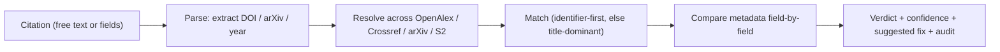

# CiteGuard

**Verify the citations an AI (or you) just wrote — does the paper actually exist, and is its metadata correct? — against live scholarly sources, from inside Claude Code, Codex, or Cursor.**

CiteGuard is a **falsification-first** toolkit for trustworthy scientific writing. Instead of trusting a draft and its reference list, it treats every citation as a `claim → citation → evidence` problem and tries to *disprove* it: resolve the paper, check the metadata, and (later) test whether it actually supports the sentence.

- **Status:** Alpha. v1 ships claim-free **existence + metadata verification**, exposed as an MCP server and a Claude Code skill.
- **Philosophy:** behave like a skeptical reviewer, not an eager autocomplete. When unsure, say "could not be verified" — never falsely accuse.

---

## See it work


Run the demo yourself (hits live OpenAlex + arXiv):

```bash
python3 scripts/demo_verify.py
```

```text
Verifying 2 citations against OpenAlex + arXiv ...

[OK] VERIFIED           (confidence 0.7)
    Vaswani et al., "Attention Is All You Need", arXiv:1706.03762
    sources checked: openalex, arxiv
    Citation resolves to a real record and the provided metadata matches.

[X] NOT_FOUND          (confidence 0.8419)
    (LLM-fabricated) "Quantum Teleportation of Citation Hallucinations in Alpacas"
    sources checked: openalex, arxiv
    Could not be verified in openalex, arxiv.
```

Or call it from Python:

```python
from src.retrieval.scholarly_clients import build_live_metadata_source
from src.verification import parse_citation, verify_citation

source = build_live_metadata_source(["openalex", "arxiv"], mailto="you@example.com")
result = verify_citation(parse_citation(title="Attention Is All You Need", arxiv_id="1706.03762"), source)
print(result.verdict.value, result.confidence)   # -> verified 0.7
```

> Output is real, captured live. Confidence and the matched record reflect live source
> data, so exact numbers can drift over time.

---

## Why this exists

Citation hallucinations are dangerous because they look polished while being wrong in at least three different ways:

1. **The paper does not exist** (fabricated reference).
2. **The metadata is stitched together incorrectly** (real-looking but wrong author/year/venue/DOI).
3. **The paper exists, but does not support the sentence it is cited for** (phantom support).

LLM writing assistants commit all three. CiteGuard gives an agent the ability to *check* — the part it cannot do reliably on its own.

## What it does today (v1)

- Resolve a citation against **OpenAlex, Crossref, arXiv, and Semantic Scholar**.
- Return one of four verdicts, with a confidence score and which sources were checked:

  | verdict | meaning |
  |---|---|
  | `verified` | the paper exists and the provided metadata matches |
  | `metadata_mismatch` | the paper exists but a field disagrees — comes with a suggested corrected citation |
  | `not_found` | could not be verified in the queried sources (flagged high-risk, **not** declared fake) |
  | `ambiguous` | several plausible matches — asks for a DOI/arXiv id to disambiguate |

- **Suggest a fix** (the canonical reference) instead of silently rewriting your citation.
- **Two entry points:** verify one citation, or audit a whole reference list and get a summary.

> v1 is deliberately scoped to "phantom-citation defense". Claim-support (NLI) and contradiction detection are **not** in v1 — see [Status & roadmap](#status--roadmap).



---

## Use it as an agent tool (MCP) — the primary path

Lets Claude Code, Codex, Cursor, Cline, and any other MCP client call CiteGuard while writing.

> Requires **Python ≥ 3.10** (the MCP SDK does not support 3.9; the core library and tests still run on 3.9).

```bash
python -m pip install -e ".[mcp]"
citeguard-mcp          # stdio transport
```

Configure it in an MCP client (Claude Code example):

```json
{
  "mcpServers": {
    "citeguard": { "command": "citeguard-mcp" }
  }
}
```

**Exposed tools**

- `verify_citation_tool` — verify one citation (free-text `raw_text` or fields `title`/`authors`/`year`/`doi`/`arxiv_id`/`venue`). Returns verdict, canonical record, per-field diffs, suggested fix, and sources checked.
- `audit_citations_tool` — verify a list; returns a per-item report plus a verdict-count summary.

**Environment variables**

| variable | default | purpose |
|---|---|---|
| `CITEGUARD_SOURCES` | `openalex,crossref,arxiv` | which sources to query |
| `CITEGUARD_MAILTO` | `research@example.com` | polite-pool contact for OpenAlex/Crossref |
| `SEMANTIC_SCHOLAR_API_KEY` | — | optional, improves Semantic Scholar access |
| `CITEGUARD_CACHE` | `data/logs/verification_cache.sqlite` | local SQLite resolution cache |

### Claim support (deep mode, v2)

Beyond existence/metadata, `check_claim_support_tool` judges whether a paper actually
**supports a claim sentence**, using a reranker + NLI ensemble over the abstract.
Verdicts: `supported` / `weakly_supported` / `insufficient_evidence` / `contradicted`.
It is abstain-leaning: when the abstract does not address the claim it returns
`insufficient_evidence` (not "unsupported"). Deep models are downloaded on first use
(`pip install -e ".[models]"`, Python >= 3.10); without them it falls back to a labelled
`heuristic` engine. Pre-download with `python3 scripts/warmup_support_models.py`.

### Claude Code skill

[`skills/citeguard-verify/SKILL.md`](skills/citeguard-verify/SKILL.md) makes Claude Code **proactively** verify citations while you write (and present results without silently editing your text). Copy it into your project's `.claude/skills/` and keep the MCP server configured so the skill has tools to call.

---

## Use it as a Python library / CLI

The core library has **zero third-party dependencies** and runs on Python ≥ 3.9.

```bash
python -m pip install -e .
```

```python
from src.retrieval.scholarly_clients import build_live_metadata_source
from src.verification import parse_citation, verify_citation

source = build_live_metadata_source(["openalex", "crossref", "arxiv"], mailto="you@example.com")

result = verify_citation(
    parse_citation(title="Attention Is All You Need", arxiv_id="1706.03762"),
    source,
)
print(result.verdict.value, "→", result.explanation)
# verified → Citation resolves to a real record and the provided metadata matches.
```

For a fabricated citation you'll get `not_found`; for a real paper with a wrong year, `metadata_mismatch` plus a `suggested_citation`.

### Offline, reproducible evaluation

A small, network-free benchmark proves the tool's behavior on a fixed corpus of real papers plus correct / metadata-corrupted / fabricated cases:

```bash
python3 scripts/eval_verification.py
```

It reports fabrication precision/recall, metadata-error detection, and — importantly — the **false-accusation rate** (real papers wrongly flagged `not_found`). The seed set scores `false_accusation_rate = 0.0` and `fabrication_recall = 1.0`.

---

## How resolution works

1. **Parse** the input; extract a DOI / arXiv id / year from free text when present.
2. **Identifier-first:** if a DOI or arXiv id is given, resolve directly (definitive).
3. **Otherwise search** by title across the selected sources and score candidates with a **title-dominant** match (title 0.70 / authors 0.18 / year 0.12); identifiers, when present, score 1.0.
4. **Compare** only the fields you actually provided, field by field.
5. **Decide:** `verified` / `metadata_mismatch` (+ suggested fix) / `not_found` / `ambiguous`.

Two guardrails keep it honest:

- **A source being unreachable is never escalated to "fabricated."** Outages lower confidence; the output always lists which sources were checked and which responded.
- **`not_found` is phrased as "could not be verified",** leaving the final judgment to the human or host agent.

---

## Status & roadmap

**Done (v1)** — existence + metadata verification, MCP server, Claude Code skill, offline eval, multi-source adapters, SQLite caching.

**Planned (v2)**

- **Claim-support verification** (does the paper actually back the sentence?) via the reranker + NLI ensemble already wired in [`src/verifiers/`](src/verifiers/) — designed to run as an optional, slower "deep mode".
- **Contradiction detection** (replacing the current keyword heuristic).
- **Same-title / year disambiguation** (see limitations below).
- A larger, human-reviewed benchmark with cross-domain slices and verifier ablations.

### Known limitations (v1)

- **Identifiers are the reliable path.** When a citation includes a DOI or arXiv id, resolution is definitive — provide one whenever possible.
- **Title-only matching is best-effort.** A title can map to several records in a source (e.g. an original paper plus a later reprint/re-index with a different `publication_year`). Without an identifier, a correctly-cited paper can resolve to a same-title record and be reported as a `metadata_mismatch` on `year`/`venue`. Treat title-only year/venue mismatches as "needs confirmation", not proof the citation is wrong.
- v1 verifies existence and metadata only; support and contradiction checks are v2.

> **Note on the earlier prototype.** This repository also contains an end-to-end *falsification-first writing agent* (planner → claim decomposition → constrained writer → audit) under [`src/orchestrator/`](src/orchestrator/), [`src/planner/`](src/planner/), and [`src/writer/`](src/writer/). It was the project's original framing and is kept for research/reference, but the verification capability above is the actively developed direction.

---

## Installation options

```bash
python -m pip install -e .            # core library (no deps)
python -m pip install -e ".[mcp]"     # + MCP server (Python >= 3.10)
python -m pip install -e ".[models]"  # + reranker/NLI stack for v2 support (heavy)
python -m pip install -e ".[api]"     # + FastAPI surface
```

## Tests & reproducibility

```bash
python3 -m unittest discover -s tests -v   # full suite
python3 scripts/eval_verification.py       # offline verification eval
```

GitHub Actions CI runs the unit-test suite plus a lightweight heuristic demo evaluation on every push.

## Repository layout

```text
CiteGuard/
├── src/
│   ├── verification/        # v1 core: parse, resolve, verify, audit, cache, eval
│   ├── mcp_server/          # FastMCP server exposing the verification tools
│   ├── retrieval/           # scholarly source adapters (OpenAlex/Crossref/arXiv/S2) + retrievers
│   ├── verifiers/           # existence/metadata + reranker+NLI support stack (v2)
│   ├── orchestrator/ planner/ writer/ graph/ citation/ audit/   # earlier writing-agent prototype
│   └── benchmark/ api/
├── skills/citeguard-verify/ # Claude Code skill
├── data/eval/               # offline verification benchmark
├── scripts/                 # runnable entry points (eval, agent demo, corpus tools)
├── configs/  docs/  tests/  experiments/
└── pyproject.toml
```

## Documents

- Design spec: [docs/superpowers/specs/2026-06-03-citeguard-verification-mcp-design.md](docs/superpowers/specs/2026-06-03-citeguard-verification-mcp-design.md)
- Implementation plan: [docs/superpowers/plans/2026-06-03-citeguard-verification-mcp.md](docs/superpowers/plans/2026-06-03-citeguard-verification-mcp.md)
- Research proposal: [docs/proposal.md](docs/proposal.md) · Architecture: [docs/architecture.md](docs/architecture.md) · Roadmap: [ROADMAP.md](ROADMAP.md)

## Citation

If you use this repository in research, please cite the software record in [CITATION.cff](CITATION.cff).

## License

Released under the [MIT License](LICENSE).

---

## 中文说明

**CiteGuard 是一个"证伪优先"的引用核验工具**:在你(或 AI)写完综述、参考文献后,它去**真实学术库**里逐条核对——这篇论文到底**存不存在**、**元数据(标题/作者/年份/venue/DOI)对不对**——并能作为 **MCP server / Claude Code skill** 被主流 agent(Claude Code、Codex、Cursor 等)直接调用。

当前为 Alpha。**v1 只做"防幻觉"**:存在性 + 元数据核验,返回四种裁定 `verified / metadata_mismatch / not_found / ambiguous`,发现问题给出**改正建议**,且坚持"宁可说查不准,也不乱指控"。支撑性(NLI)与矛盾检测属于 v2。

最快上手:

```bash
python -m pip install -e ".[mcp]"   # 需 Python ≥ 3.10
citeguard-mcp                        # 在 MCP 客户端里配置 "command": "citeguard-mcp"
```

或当作零依赖 Python 库使用(见上方 *Use it as a Python library* 一节)。核心库与测试在 Python ≥ 3.9 下运行;离线评测见 `python3 scripts/eval_verification.py`。

**已知局限**:有 DOI/arXiv 时核验最可靠;仅凭标题时,同名再版记录可能导致年份/venue 误报,应视为"待确认"。详见上文 *Known limitations*。

**中文支持**:文本匹配已支持中文(CJK 分词 + 字符二元组),可核验 OpenAlex/Crossref 中已收录的中文论文。支撑性深度模式判定中文 claim 时,建议用环境变量配置多语模型:`CITEGUARD_RERANKER_MODEL`、`CITEGUARD_NLI_MODEL`。知网/万方无开放免费 API,本项目不直连、不爬取受限内容。
