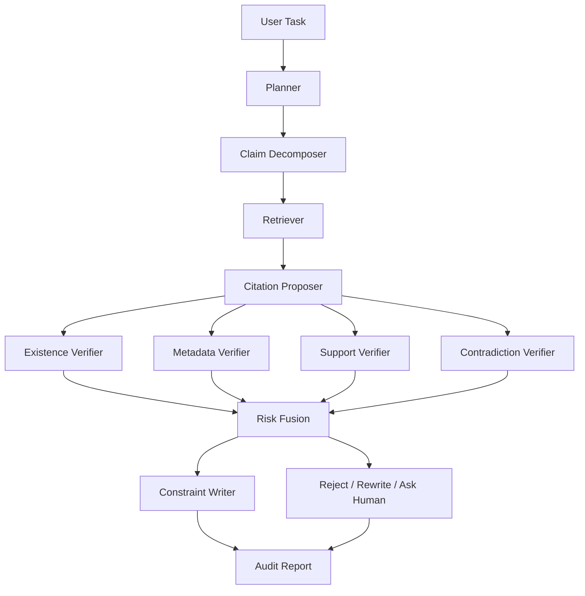

# CiteGuard 开题报告

> 注: 本文档是项目开题与研究设计说明，不应直接当作经过正式文献核验的综述使用。若将其中提及的外部工作用于论文写作，请单独核对原始来源。

**项目名称**: CiteGuard  
**英文副标题**: A Falsification-First Agent for Trustworthy Scientific Writing  
**中文副标题**: 面向论文写作引用幻觉抑制的自证伪科研 Agent  
**文档日期**: 2026-04-20  
**聚焦问题**: 大模型在论文写作中容易编造不存在的论文、错误拼接作者与标题、引用真实论文但并不支持当前论断，导致“参考文献幻觉”和“伪支撑引用”问题。

---

## 1. 选题背景与研究意义

随着大模型和 Agent 系统被越来越多地用于文献综述、Related Work、研究提案和实验报告撰写，学术写作中的“引用可靠性”正在成为一个核心瓶颈。相比一般事实性幻觉，论文写作中的引用幻觉更危险，因为它会以规范化的学术形式进入参考文献列表，容易通过人工快速审稿。

截至 **2026 年 4 月 20 日**，近期工作已经给出很强的警示信号：

- **OpenScholar** 在 2024 年提出了面向科学文献综合的检索增强生成框架，并指出通用模型在科学写作中存在很高的引用幻觉率；其 2026 年 Nature 正式版进一步指出，即便更强的新模型在标题级幻觉上有所下降， fabricated citations 依然普遍存在。
- **GhostCite** 于 **2026 年 2 月 6 日** 发布，构建了大规模引用有效性分析框架，报告 13 个模型在 40 个领域上的幻觉率差异巨大，并发现 2025 年无效或伪造引用问题有明显上升。
- **How LLMs Cite and Why It Matters** 于 **2026 年 2 月 7 日** 发布，进一步表明提示方式、学科领域和模型家族都会显著影响引用幻觉，并说明多模型共识与字符串级轻量筛查具有实用价值。
- **The AI Scientist-v2** 展示了科研 Agent 在自动生成 workshop 级论文方面的能力，但 **AI Scientists Fail Without Strong Implementation Capability** 明确指出当前 AI Scientist 的核心瓶颈是“验证缺口”，即能生成但难以严谨核验。

这说明当前问题已经不再是“Agent 会不会写”，而是“Agent 写出来的学术论断和引用能否被系统性证伪”。因此，本项目的研究意义在于：

- 从“生成优先”转向“证伪优先”，将学术写作从语言流畅性问题提升为可验证性问题。
- 把“参考文献是否真实存在”与“参考文献是否真的支持该句论断”拆开建模，解决当前系统只检索不核验的弱点。
- 为科研 Agent 提供可审计、可追溯、可拒答的基础能力，提升其在高风险学术场景中的可信度。

---

## 2. 国内外研究现状

### 2.1 科学写作 Agent 与文献综述系统

已有系统主要有两类：

- **通用 LLM 写作**: 依赖大模型直接生成综述或论文草稿，优点是流畅、灵活，缺点是容易产生伪引用。
- **检索增强科研写作**: 如 OpenScholar、PaperQA 类方法，通过检索 scientific corpus 约束生成，但重点仍在“找到相关文献”，而非“对每个引用进行逐条证伪”。

当前这类工作说明检索是必要条件，但不是充分条件。真实论文写作中，危险的不仅是“引用不存在”，还包括“引用真实论文但与句子不匹配”。

### 2.2 引用幻觉与引用归因问题

最近的研究已经表明：

- 模型会虚构论文标题、作者、年份或 venue。
- 模型会把多个真实论文的元信息错误拼接成一条“看起来合理”的新引用。
- 模型会给出真实存在的论文，但该论文摘要或正文并不支持当前论断。

REASONS、AttributionBench 等工作说明，自动引用生成与归因评估本身就是高难问题，尤其在跨领域和间接归因场景下更明显。

### 2.3 科研 Agent 的验证缺口

AI Scientist-v2 与 MLR-Bench 一类工作表明，科研 Agent 已经进入“开放式研究任务”阶段，但系统性的证伪机制仍然薄弱。现有多数系统采用的是：

- 自反思
- 多轮改写
- 检索增强
- 多 agent 讨论

但它们往往缺少一个显式的“反方代理”去尝试否定每一个引用和论断之间的关系。换句话说，当前科研 Agent 更像“写作者”，不像“审稿人”。

### 2.4 现有工作的不足

当前研究至少还存在四个明显空缺：

1. 缺少面向**论文写作场景**的逐句引用证伪框架。
2. 缺少把**存在性验证、元数据验证、证据支撑验证、矛盾验证**统一起来的 Agent 架构。
3. 缺少把**拒绝生成不可靠引用**作为一等决策目标的控制机制。
4. 缺少面向“引用完整性”的系统化 benchmark 与评估指标。

---

## 3. 研究问题与目标

### 3.1 核心研究问题

本项目聚焦以下四个研究问题：

**RQ1**: 在科研写作任务中，引入“先证伪、后成文”的 Agent 控制流程，能否显著降低不存在引用与伪支撑引用的比例？

**RQ2**: 在引用核验过程中，哪类证伪模块最关键：论文存在性验证、元数据一致性验证、证据支撑验证，还是矛盾检测？

**RQ3**: 当证据不足或检索结果不稳定时，Agent 的“拒绝引用/请求人工确认”机制能否比强行生成更有效？

**RQ4**: 该方法能否从计算机科学领域迁移到医学、生物、材料等高密度学术引用领域？

### 3.2 总体研究目标

构建一个面向论文写作的 **Falsification-First Scientific Writing Agent**，在生成相关工作、文献综述和研究计划时，对每一条候选引用先执行程序化证伪，再决定是否允许进入正文。

### 3.3 具体目标

- 设计一个“**论断-引用-证据图**”驱动的科研写作 Agent。
- 提出一套多阶段引用证伪算法，覆盖存在性、元数据、支撑性和矛盾性检查。
- 设计一个“高风险拒答”机制，在无法验证时不生成虚假引用。
- 构建一个适用于科研写作的评测集与指标体系。
- 与普通写作 LLM、RAG 写作、self-reflection 和多 agent debate 等基线比较。

---

## 4. 研究内容

### 4.1 任务定义

输入为：

- 一个研究主题、问题或论文题目
- 可选的用户草稿、目标章节类型、时间范围、领域约束

输出为：

- 一段或多段科研写作文本
- 每个句子绑定的引用
- 每条引用的验证证据、置信度、风险等级与审计记录

本项目重点关注三类任务：

1. **Related Work 生成**
2. **Literature Review 生成**
3. **Research Proposal / 开题背景综述生成**

### 4.2 核心研究内容

#### 内容一: 论断级写作单元建模

将科研写作从“段落生成”拆为“原子论断生成”。每个段落先被规划为若干 `claim units`，每个 claim 必须绑定证据后才能写入正文。

#### 内容二: 候选引用生成与反向证伪

Agent 不是直接生成参考文献，而是先提出候选论文集合，再由反方证伪器尝试推翻这些候选：

- 这篇论文是否真实存在
- 标题、作者、年份、venue 是否一致
- 该论文是否真的支持该句 claim
- 是否存在与该 claim 更矛盾或更强的反例文献

#### 内容三: 证据驱动改写与拒答

如果某个 claim 无法找到高质量支撑，系统不允许“凭语言补全”。它只能：

- 改写为更弱、更保守的表达
- 删除该句
- 显式标记需要人工确认

#### 内容四: 面向科研写作的引用完整性评测

构建一个新的 benchmark，重点评估：

- 是否引用了真实存在的论文
- 该论文是否支撑对应句子
- 引用元数据是否完整准确
- 当证据不足时是否能正确 abstain

---

## 5. 方法设计与技术路线

### 5.1 总体思想

本项目提出的核心思想是：

> 传统科研写作 Agent 是“先写再检查”，本项目改为“先找证据、先尝试证伪、最后才允许写”。

系统的决策对象不再是整段文本，而是 `claim -> citation -> evidence` 三元关系。

### 5.2 总体架构

系统由七个核心层组成：

1. **任务规划层**
2. **论断分解层**
3. **学术检索层**
4. **候选引用生成层**
5. **证伪与验证层**
6. **受约束写作层**
7. **审计与评估层**

### 5.3 核心数据结构: CCEG

本项目提出 `CCEG (Claim-Citation-Evidence Graph)`，作为系统核心中间表示。

图中包含三类节点：

- `Claim Node`: 原子科研论断
- `Citation Node`: 候选论文
- `Evidence Node`: 摘要句、正文片段、元数据记录

图中包含五类边：

- `retrieved_from`
- `supports`
- `weak_supports`
- `contradicts`
- `unverified`

只有当 `Claim Node` 连接到足够强的 `supports` 边，且该边对应的 Citation Node 通过存在性与元数据一致性验证后，该 claim 才允许被写入正文。

### 5.4 核心算法流程

#### 阶段 A: 章节规划与 claim 生成

- 输入研究主题
- 生成章节结构、子主题和待写论断
- 将长段落目标拆成细粒度 claim 列表

#### 阶段 B: 候选文献召回

- 基于关键词、主题扩展和 claim 重写进行检索
- 混合使用 BM25 + dense retrieval + scholarly API 检索
- 从多源学术数据库召回候选文献

#### 阶段 C: 候选引用提名

- 为每个 claim 提名 Top-K 候选论文
- 抽取候选论文的标题、作者、年份、摘要、关键片段

#### 阶段 D: Falsifier 反向证伪

这是系统的关键创新层，包含五个子验证器：

1. **Existence Verifier**
   - 对接 Crossref、OpenAlex、Semantic Scholar、arXiv 等来源
   - 判断候选论文是否真实存在

2. **Metadata Verifier**
   - 对标题、作者、年份、venue 做字符串规范化和模糊匹配
   - 检测“半真半假”的拼接引用

3. **Evidence Support Verifier**
   - 判断论文摘要或正文片段是否支持该 claim
   - 可建模为 claim-evidence entailment / support classification

4. **Contradiction Verifier**
   - 检索反例论文
   - 判断当前 claim 是否被已有文献削弱或否定

5. **Uncertainty Gate**
   - 汇总多验证器输出形成风险分数
   - 风险过高时禁止生成引用，并触发保守改写或人工确认

#### 阶段 E: 受约束写作

Writer 只能在图中读取“已验证”的 claim-citation 关系来写作。任何没有通过核验的候选引用都不能进入最终文本。

#### 阶段 F: 审计输出

输出的不只是正文，还包括：

- 每句对应的证据来源
- 每条引用的验证路径
- 被拒绝的候选引用及原因
- 风险摘要

### 5.5 技术路线图

```text
研究主题/写作任务
    -> 章节规划器
    -> Claim 分解器
    -> 多路学术检索器
    -> 候选引用提名器
    -> Falsifier 证伪引擎
         -> 存在性验证
         -> 元数据验证
         -> 支撑性验证
         -> 矛盾验证
         -> 不确定性门控
    -> 受约束写作器
    -> 审计报告 + 参考文献列表 + 风险日志
```

---

## 6. 项目架构设计

### 6.1 系统架构

建议采用“**Orchestrator + Tooling + Verifier + Writer**”的分层架构。

#### A. Orchestrator 层

负责状态机与流程调度：

- 任务状态管理
- 节点级重试
- 风险阈值控制
- 失败回退与人工接管

可采用 LangGraph 或自定义状态机实现。

#### B. Scholarly Tooling 层

负责外部学术资源访问：

- OpenAlex API
- Crossref API
- Semantic Scholar API
- arXiv API
- 本地 scientific corpus 检索库

#### C. Verifier 层

负责多路证伪：

- 文献存在性
- 元数据一致性
- claim-evidence 支撑关系
- 反例检索与矛盾判断
- 置信度融合

#### D. Writer 层

负责受约束生成：

- 章节级写作
- 句子级引用插入
- 风格控制
- 保守改写

#### E. Audit 层

负责可解释输出：

- 句子到证据的对齐映射
- 引用风险报告
- 错误分析可视化

### 6.2 模块交互图



### 6.3 存储设计

建议维护三类存储：

- **文献元数据库**
  - 论文 ID、标题、作者、年份、venue、DOI、URL
- **证据库**
  - 摘要、正文 chunk、support score、contradiction score
- **审计日志库**
  - 每次生成、验证、拒绝和改写的轨迹

可采用：

- PostgreSQL / SQLite 保存结构化元数据
- FAISS / Qdrant 保存向量索引
- Parquet / JSONL 保存实验日志

---

## 7. 项目技术目录设计

建议采用以下代码结构：

```text
falsification-first-agent/
├── README.md
├── configs/
│   ├── model.yaml
│   ├── retrieval.yaml
│   ├── verifier.yaml
│   └── experiment.yaml
├── data/
│   ├── raw/
│   ├── processed/
│   ├── benchmark/
│   └── logs/
├── docs/
│   ├── proposal.md
│   ├── architecture.md
│   ├── benchmark_design.md
│   └── error_analysis.md
├── scripts/
│   ├── build_corpus.py
│   ├── harvest_openalex.py
│   ├── build_index.py
│   ├── run_agent.py
│   └── evaluate.py
├── src/
│   ├── orchestrator/
│   │   ├── graph.py
│   │   ├── states.py
│   │   └── policies.py
│   ├── planner/
│   │   ├── outline_planner.py
│   │   └── claim_decomposer.py
│   ├── retrieval/
│   │   ├── bm25_retriever.py
│   │   ├── dense_retriever.py
│   │   ├── hybrid_retriever.py
│   │   └── scholarly_clients/
│   ├── citation/
│   │   ├── proposer.py
│   │   ├── normalizer.py
│   │   └── formatter.py
│   ├── verifiers/
│   │   ├── existence_verifier.py
│   │   ├── metadata_verifier.py
│   │   ├── support_verifier.py
│   │   ├── contradiction_verifier.py
│   │   ├── uncertainty_gate.py
│   │   └── risk_fusion.py
│   ├── graph/
│   │   ├── cceg.py
│   │   └── graph_store.py
│   ├── writer/
│   │   ├── constrained_writer.py
│   │   ├── reviser.py
│   │   └── abstention_controller.py
│   ├── audit/
│   │   ├── provenance.py
│   │   ├── report_builder.py
│   │   └── visualization.py
│   ├── benchmark/
│   │   ├── dataset_builder.py
│   │   ├── metrics.py
│   │   └── baselines.py
│   └── api/
│       ├── app.py
│       └── schemas.py
├── experiments/
│   ├── exp01_baselines/
│   ├── exp02_ablation/
│   ├── exp03_recent_papers/
│   ├── exp04_long_tail_domains/
│   └── exp05_human_eval/
├── tests/
│   ├── test_retrieval.py
│   ├── test_verifiers.py
│   ├── test_writer.py
│   └── test_metrics.py
└── paper/
    ├── figures/
    ├── tables/
    └── references.bib
```

---

## 8. 关键算法设计

### 8.1 风险分数融合

对每个候选引用 \(c\) 和 claim \(q\)，定义综合可信度：

\[
Score(q, c) = \alpha S_{exist} + \beta S_{meta} + \gamma S_{support} - \delta S_{contra} - \lambda S_{uncertainty}
\]

其中：

- \(S_{exist}\): 文献存在性得分
- \(S_{meta}\): 元数据一致性得分
- \(S_{support}\): 支撑性得分
- \(S_{contra}\): 矛盾性得分
- \(S_{uncertainty}\): 不确定性惩罚项

当分数低于阈值 \(\tau\) 时，Writer 不得输出该引用。

### 8.2 拒答与保守改写策略

系统需显式支持三类动作：

- `cite`: 允许引用并成文
- `rewrite`: 将原本强断言改写成更保守描述
- `abstain`: 不给出引用，转为“需要人工核查”

这个动作选择可以建模为一个受约束策略学习问题，也可以先用规则系统实现。

### 8.3 Falsification 优先策略

与普通 verifier 不同，本项目强调“先找能否推翻该引用”，而不是“尽量证明它对”。这可以通过以下方式实现：

- 先进行反例检索，再做支持检索
- 优先寻找 metadata 冲突
- 支持证据不足时默认拒绝，而非默认接受

这种设计更符合学术审稿和科学证伪逻辑。

---

## 9. 数据集与 Benchmark 设计

### 9.1 Benchmark 暂定名称

建议命名为：

- **CiteGuardBench**
- 或 **PhantomRefBench**
- 或 **ClaimCiteBench**

其中我最推荐 **CiteGuardBench**，更容易传播。

### 9.2 数据来源

可组合以下来源：

- OpenAlex / Crossref 元数据
- arXiv / Semantic Scholar 可公开论文信息
- peS2o / S2ORC 风格开源 scientific corpus
- 开源综述论文中的句子-引用对

### 9.3 任务构造

设计四类子任务：

1. **Citation Existence Verification**
   - 给定引用字符串，判断其是否真实存在

2. **Claim-to-Citation Support Verification**
   - 给定科研句子和引用，判断是否支撑

3. **Reference Repair**
   - 给定错误引用，修复为真实文献或拒绝修复

4. **Falsification-First Writing**
   - 给定研究主题，生成带引用的综述段落并进行全链路评测

### 9.4 标注方案

标签建议至少包括：

- `exists / not_exists`
- `metadata_correct / metadata_incorrect`
- `supported / weakly_supported / unsupported / contradicted`
- `abstention_needed`

---

## 10. 实验设计

### 10.1 基线系统

建议设置以下基线：

1. **Direct-Write LLM**
   - 直接写 related work，不做检索

2. **RAG-Write**
   - 检索后生成，但不做逐句证伪

3. **Self-Reflection Agent**
   - 生成后自我检查

4. **Debate Agent**
   - 多 agent 讨论后决定引用

5. **OpenScholar-style Baseline**
   - 检索增强科学写作基线

### 10.2 评估指标

建议采用以下指标：

- **PCR**: Phantom Citation Rate，伪造引用率
- **MCR**: Metadata Corruption Rate，元数据错误率
- **CSR**: Claim Support Rate，论断被正确支撑的比例
- **UCR**: Unsupported Citation Rate，伪支撑引用率
- **AU**: Abstention Utility，拒答有效性
- **WQ**: Writing Quality，写作质量
- **RIS**: Reference Integrity Score，综合引用完整性分数

其中可定义：

\[
RIS = w_1 (1 - PCR) + w_2 (1 - MCR) + w_3 CSR + w_4 (1 - UCR) + w_5 AU
\]

### 10.3 核心实验

#### 实验一: 主结果对比

比较本方法与各基线在四类任务上的引用完整性表现。

#### 实验二: 消融实验

逐步去除：

- Existence Verifier
- Metadata Verifier
- Support Verifier
- Contradiction Verifier
- Uncertainty Gate

分析各模块贡献。

#### 实验三: 最新文献压力测试

专门选择近 12 个月的新论文主题，测试模型在“训练后新知识”场景下的伪引用倾向。

#### 实验四: 长尾领域迁移实验

在材料、医学、生物等领域测试泛化能力。

#### 实验五: 人工评测

邀请研究生或研究助理评估：

- 可用性
- 可信度
- 修改成本
- 愿不愿意在真实写作中使用

---

## 11. 创新点

本项目的主要创新点可概括为五条：

1. **提出 Falsification-First 科研写作范式**
   - 将科学写作 Agent 从“生成优先”转为“证伪优先”

2. **提出 CCEG 中间表示**
   - 用论断-引用-证据图替代纯文本流水线

3. **设计多阶段引用证伪引擎**
   - 统一存在性、元数据、支撑性和矛盾性验证

4. **引入拒答与保守改写控制**
   - 将“不乱引文献”作为显式优化目标

5. **构建面向学术写作的引用完整性 benchmark**
   - 推动科研 Agent 从写得像转向写得可信

---

## 12. 可行性分析

### 12.1 理论可行性

本项目并非完全从零开始，而是在三条成熟技术链之上集成创新：

- 科学文献检索与 RAG
- claim verification / attribution
- agent orchestration 与风险控制

### 12.2 工程可行性

所需组件大多已有公开实现路径：

- 学术元数据 API 可用
- 向量检索与 rerank 工具成熟
- NLI / entailment 模型可迁移到 claim-evidence support
- Agent 状态机可用 LangGraph 或自定义实现

### 12.3 数据可行性

OpenAlex、Crossref、arXiv、Semantic Scholar 等可为前期原型提供足够支撑；公开 scientific corpus 可用于构建本地索引。

---

## 13. 研究计划与时间安排

### 第一阶段: 问题定义与原型系统

时间: 第 1-2 个月

- 完成相关文献调研
- 确定任务定义与指标
- 实现基础检索与存在性验证模块

### 第二阶段: 核心算法开发

时间: 第 3-4 个月

- 实现 CCEG
- 实现 metadata / support / contradiction verifier
- 打通 falsification-first 写作流程

### 第三阶段: Benchmark 构建与实验

时间: 第 5-6 个月

- 构建 CiteGuardBench
- 训练或调优 support verifier
- 完成主实验与消融实验

### 第四阶段: 系统完善与论文撰写

时间: 第 7-8 个月

- 完成人工评测
- 进行错误分析
- 撰写论文与答辩材料

---

## 14. 预期成果

### 14.1 学术成果

- 1 篇完整论文
- 1 套可复现实验
- 1 个面向科研写作的 benchmark

### 14.2 系统成果

- 1 个 Falsification-First 科研写作 Agent 原型
- 1 个引用审计与风险报告界面
- 1 套可扩展的 scholarly verification toolkit

### 14.3 开源成果

- 开源代码仓库
- 开源 benchmark 数据
- 开源实验脚本与评测脚本

---

## 15. 可能风险与应对方案

### 风险一: 支撑性验证难度高

原因：

- 摘要未必覆盖具体 claim
- 一句 claim 可能需要多篇论文共同支撑

应对：

- 先从摘要级 support 做原型
- 再扩展到正文 chunk 级验证
- 支持多引用共同支撑一个 claim

### 风险二: API 覆盖不完整

应对：

- 多源交叉验证
- 构建本地缓存和本地索引

### 风险三: 系统太保守导致写作质量下降

应对：

- 将“保守改写”加入 Writer
- 在质量与安全之间做阈值扫描

### 风险四: 标注成本较高

应对：

- 采用自动构造 + 小规模人工校验的混合方案

---

## 16. 论文标题建议

可以从以下几个版本中选择：

1. **Falsification-First Scientific Writing Agents: Reducing Citation Hallucinations via Claim-Citation-Evidence Verification**
2. **CiteGuard: A Falsification-First Agent for Trustworthy Scientific Writing**
3. **From Fluency to Verifiability: A Falsification-First Agent for Citation-Safe Academic Writing**
4. **Claim Before Cite? No: Falsification-First Scientific Writing with Verifiable References**

我最推荐第 2 个标题，传播性最好。

---

## 17. 建议技术栈

### 后端与 Agent

- Python 3.11
- FastAPI
- LangGraph 或自定义 workflow engine
- Pydantic

### 检索与存储

- FAISS 或 Qdrant
- SQLite / PostgreSQL
- Elasticsearch 或 Pyserini 可选

### 模型与推理

- 开源 embedding model
- reranker model
- NLI / entailment model
- 1 个主写作 LLM
- 1 个轻量 verifier LLM 或分类器

### 数据处理

- Pandas
- DuckDB
- JSONL / Parquet

### 可视化与评测

- Streamlit 或 Gradio
- Weights & Biases
- matplotlib / seaborn

### 17.1 第一版 MVP 开发优先级

如果要尽快做出一个可投稿、可演示、可扩展的第一版，建议按下面顺序推进：

**MVP-1: 引用存在性防幻觉**

- 输入一个 claim 或 related work 段落需求
- 检索候选论文
- 完成 existence + metadata 双重验证
- 输出“只包含真实存在论文”的初版 related work

**MVP-2: 支撑性验证**

- 为每个 claim 绑定摘要证据
- 过滤掉“存在但不支撑”的引用
- 输出 claim-citation-evidence 对齐表

**MVP-3: 反例检索与保守改写**

- 加入 contradiction verifier
- 对高风险 claim 启用 rewrite / abstain
- 输出可审计的风险报告

**MVP-4: Benchmark 与论文实验版**

- 固化 CiteGuardBench
- 跑主实验、消融实验、长尾领域实验
- 输出论文图表、案例分析和错误分析

### 17.2 建议的最小可发表版本

如果希望控制工程复杂度，我建议论文初稿先聚焦这三个贡献：

1. Falsification-First 科研写作框架  
2. Existence + Metadata + Support 三阶段 verifier  
3. CiteGuardBench 与 RIS 指标

先不要把系统做得太“全能”，而要把“引用完整性”这个主问题打透。这样论文主题会更集中，也更容易形成清晰贡献边界。

---

## 18. 参考文献建议

以下文献适合作为开题报告和后续论文的核心参考：

1. Asai, A. et al. **OpenScholar: Synthesizing Scientific Literature with Retrieval-augmented LMs**. arXiv:2411.14199, 2024.  
2. Asai, A. et al. **Synthesizing scientific literature with retrieval-augmented language models**. Nature, published online on **2026-02-04**.  
3. Xu, Z. et al. **GhostCite: A Large-Scale Analysis of Citation Validity in the Age of Large Language Models**. arXiv:2602.06718, submitted on **2026-02-06**.  
4. Naser, M. Z. **How LLMs Cite and Why It Matters: A Cross-Model Audit of Reference Fabrication in AI-Assisted Academic Writing and Methods to Detect Phantom Citations**. arXiv:2603.03299, submitted on **2026-02-07**.  
5. Yamada, Y. et al. **The AI Scientist-v2: Workshop-Level Automated Scientific Discovery via Agentic Tree Search**. arXiv:2504.08066, 2025.  
6. Zhu, M. et al. **AI Scientists Fail Without Strong Implementation Capability**. arXiv:2506.01372, 2025.  
7. Chen, H. et al. **MLR-Bench: Evaluating AI Agents on Open-Ended Machine Learning Research**. OpenReview, 2025.  
8. Tilwani, D. et al. **REASONS: A benchmark for REtrieval and Automated citationS Of scieNtific Sentences using Public and Proprietary LLMs**. arXiv:2405.02228, 2024.  
9. Li, Y. et al. **AttributionBench: How Hard is Automatic Attribution Evaluation?** arXiv:2402.15089, 2024.  

---

## 19. 一句话总结

这个项目最有价值的地方，不是再做一个会写论文的 Agent，而是做第一个把“**不敢乱引文献**”当成核心能力来优化的科研写作 Agent。
